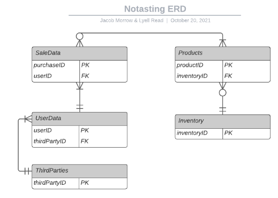
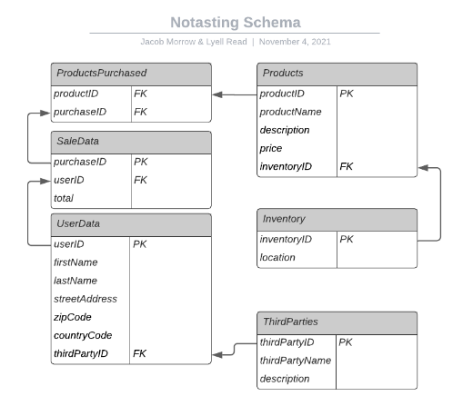
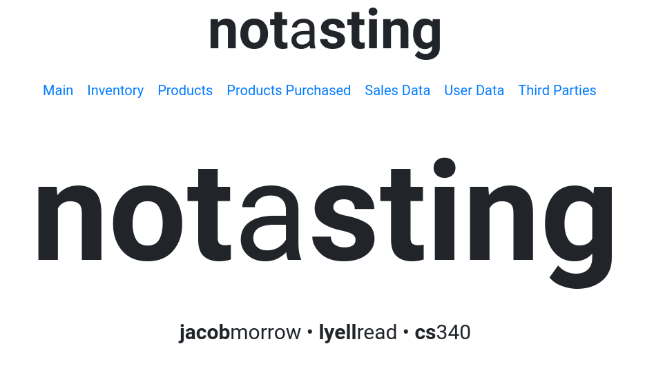
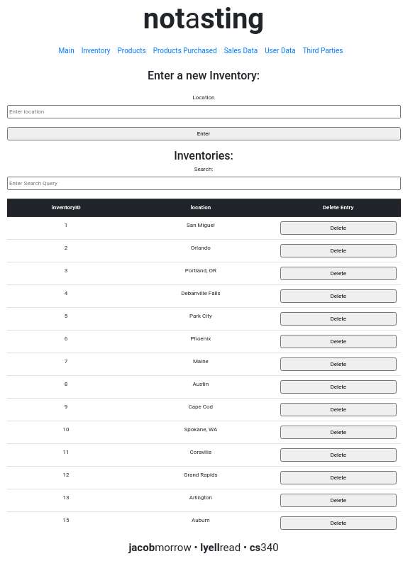
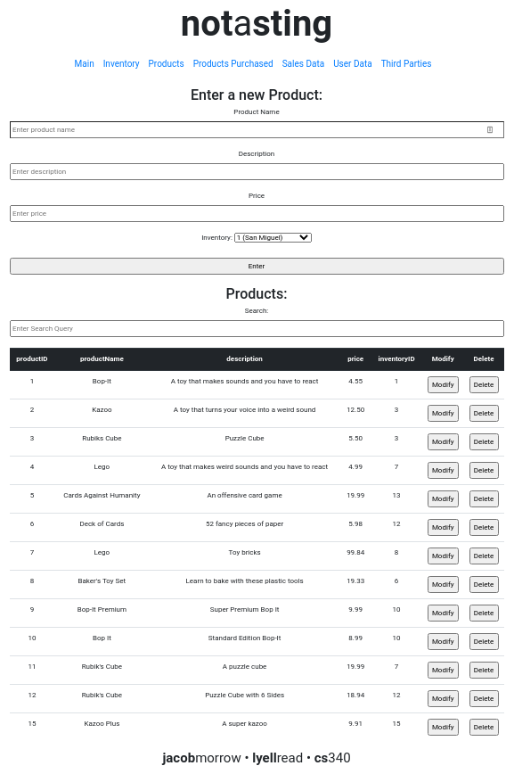
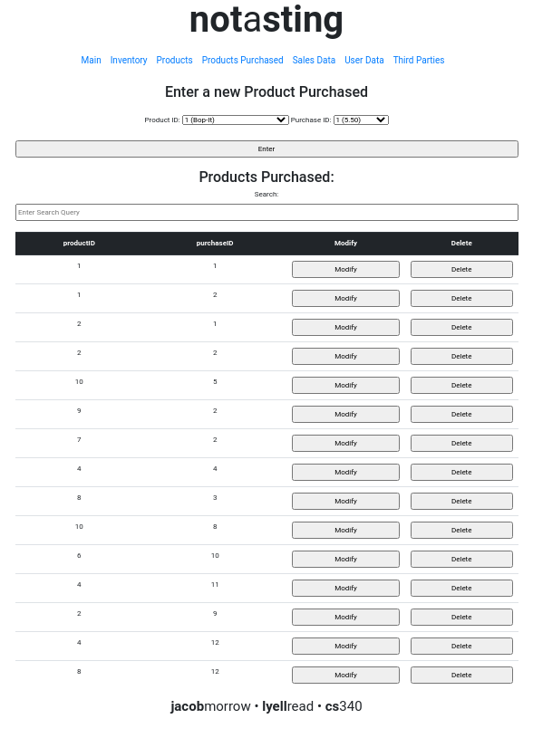
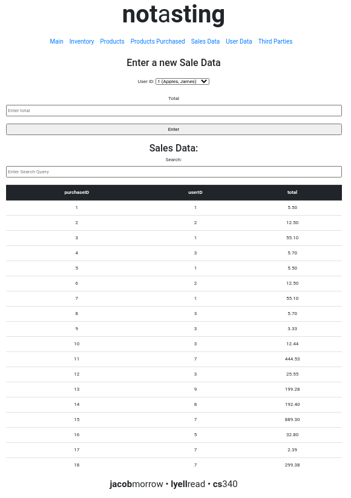
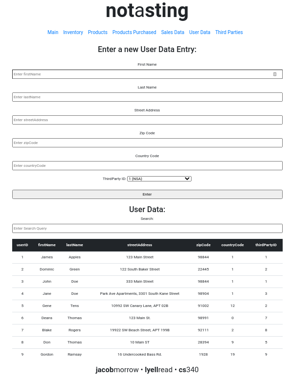
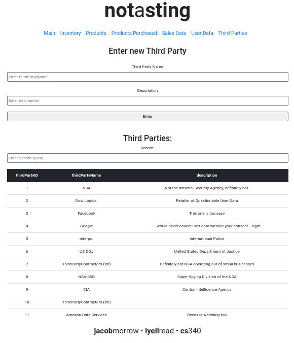

\pagebreak

# Site URL

The project can be found at: <http://128.193.54.182:4096/>

# Executive Summary
**Fixed issue: Removed ability to create arbitrary IDs when creating new table entries**

Previously, all pages allowed the entry of the ID number, otherwise known as a primary key, within their respective INSERT forms. This was redundant as all the ID numbers were set to auto-increment. Within the most recent version, the ID numbers are now unable to be set by the user, allowing auto-increment to manage it entirely. This change was inspired by peer comments, as well as instructions from the instructor.

**Fixed issue: Issues with relationships in database specification versus implementation**

The original description of Notasting stated that “Notasting operates a single, central warehouse, thus there will be a single inventory.” Having a single inventory no longer matches the current direction of the project and was removed entirely from the description. This change was made in response to peer feedback that stated that it would be more realistic to have multiple locations.

**Fixed issue: Nullable attribute in table, not a nullable foreign key**

Originally we did not have the ability to set a nullable foreign key within any of our INSERTs, only a nullable attribute was included. Within our most recent version of Notasting, we have included an implementation for a nullable foreign key in the Product's INSERT with the Inventory ID, which is displayed in the table below it. This was done as a result of examining peer feedback and project requirements.

**Fixed issue: Did not have an intersection representing our M:M relationship**

The draft for Notasting included a list to represent an attribute. The database had to be restructured entirely in order to support this addition. This created the Products Purchased table, holding the attributes Product ID and Purchase ID, to represent the many to many relationship between Products and Sales Data. This change was made in response to peer feedback and instructor feedback.

**Fixed issue: Address structure in UserData**

Initially, the database schema inefficiently handled user data, specifically addresses. The addresses were condensed into common components. These changes were made following instructor guidance, peer feedback and instructor feedback.

\pagebreak

# Project Design 

## Project Outline

Notasting, ‘totally not a CIA operation’, sells $1 million of questionable goods a year. To support this, a database-driven website was implemented in order to record the sales data related to orders of purchased products from inventory to users whose user information is being sold to third parties. 

Essentially, the database will be used to track orders and how that order information has been sold on to third party information aggregators. This is so that Notasting can understand how their operations are related to the CIA surveillance they are ‘totally not participating in’.

The database will relate Products to SaleData using ProductsPurchased, an intersection of those two entities. Further, Products will be related to Inventory in one of the central warehouses that Notasting runs. The SaleData will be associated with UserData for the user that made the purchase, and that UserData will be associated with a ThirdParty to whom that UserData was exclusively sold.

\pagebreak

# Database Design

## Database Outline

### Inventory 

Contains details about the Products stored at a location

|               |              |                             |
|:--------------|:-------------|:----------------------------|
| `inventoryID` | int(11)      | AUTO_INCREMENT, PRIMARY KEY |
| `location`    | varchar(255) | NOT NULL                    |

### Products

Contains details about Products sold in the shop

|               |               |                             |
|:--------------|:--------------|:----------------------------|
| `productID`   | int(11)       | AUTO_INCREMENT, PRIMARY KEY |
| `productName` | varchar(255)  | NOT NULL                    |
| `description` | varchar(255), |                             |
| `price`       | decimal(8,2)  | NOT NULL                    |
| `inventoryID` | int(11)       | DEFAULT NULL, FOREIGN KEY   |

### ProductsPurchased

Intersection between Products and SaleData representing M:M relationship

|              |                      |
|:-------------|:---------------------|
| `productID`  | int(11), FOREIGN KEY |
| `purchaseID` | int(11), FOREIGN KEY |

### SaleData

Contains the information associated with a purchase of Product(s)

|              |              |                             |
|:-------------|:-------------|:----------------------------|
| `purchaseID` | int(11)      | AUTO_INCREMENT, PRIMARY KEY |
| `userID`     | int(11)      | NOT NULL, FOREIGN KEY       |
| `total`      | decimal(8,2) | NOT NULL,                   |

\pagebreak

### UserData

Contains information about a user

|                 |              |                             |
|:----------------|:-------------|:----------------------------|
| `userID`        | int(11)      | AUTO_INCREMENT, PRIMARY KEY |
| `firstName`     | varchar(255) | NOT NULL,                   |
| `lastName`      | varchar(255) | NOT NULL,                   |
| `streetAddress` | varchar(255) | NOT NULL,                   |
| `zipCode`       | int(11)      | NOT NULL,                   |
| `countryCode`   | int(11)      | NOT NULL,                   |
| `thirdPartyID`  | int(11)      | NOT NULL, FOREIGN KEY       |

### ThirdParties

Contains the details of a third party to which UserData is sold

|                  |               |                             |
|:-----------------|:--------------|:----------------------------|
| `thirdPartyID`   | int(11)       | AUTO_INCREMENT, PRIMARY KEY |
| `thirdPartyName` | varchar(255)  | NOT NULL,                   |
| `description`    | varchar(255), |                             |

### Relationships

|              |                                                                                                                                                                                                                               |
|:-------------|:------------------------------------------------------------------------------------------------------------------------------------------------------------------------------------------------------------------------------|
| M:M\text{  } | **Between Products and SaleData**                                                                                                                                                                                             |
|              | A single order or SaleData can contain many Products. Further, a product can be purchased several times (in different SaleData). The PKs purchaseID and productID are both FK in the intersection relation ProductsPurchased. |
| 1:M          | **Between Inventory and Products**                                                                                                                                                                                            |
|              | Products can only be in a single Inventory, however an Inventory can contain multiple Products. This relationship is exemplified as the Inventory PK inventoryID being FK in Products.                                        |
| 1:M          | **Between SaleData and UserData**                                                                                                                                                                                             |
|              | A SaleData can only be purchased by one user, however a user can purchase many SaleData. This is represented by the userID (PK for User) being FK in SaleData.                                                                |
| 1:M          | **Between UserData and ThirdParties**                                                                                                                                                                                         |
|              | A UserData can only be sold to one ThirdParties, however ThirdParties can buy many UserData. This is represented by thirdPartyID (PK for ThirdParties) being FK in UserData.                                                  |

\pagebreak

## Entity-Relation Diagram

{height=65%}

\pagebreak

## Database Schema

{height=65%}

\pagebreak

# Website Screen Captures

## Homepage

{height=65%}

\pagebreak

## CREATE / READ / DELETE Inventories

{height=65%}

\pagebreak

## CREATE / READ / UPDATE / DELETE Products

{height=65%}

\pagebreak

## CREATE / READ / UPDATE / DELETE ProductsPurchased

{height=65%}

\pagebreak

## CREATE / READ SaleData

{height=65%}

\pagebreak

## CREATE / READ UserData

{height=65%}

\pagebreak

## CREATE / READ ThirdParties

{height=65%}

